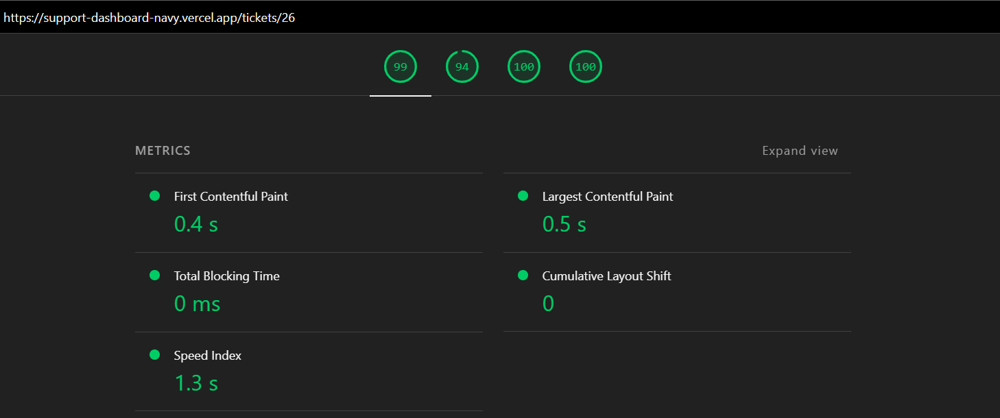

# AI-Powered Customer Support Dashboard

A modern AI-assisted customer support dashboard built as part of the ReeRoute Full Stack Engineering Assignment.

## Live Demo

🌐 https://support-dashboard-navy.vercel.app/

## GitHub Repository

📦 https://github.com/Lokesh777/support-dashboard

---

# Features

## Ticket Management

- View all support tickets
- Search tickets
- Filter by Status
- Filter by Priority
- Sort tickets
- Ticket detail page
- Update ticket status
- Internal notes
- Activity timeline

## AI Features

- AI Ticket Summary
- AI Suggested Reply
- AI Sentiment Analysis

---

# Tech Stack

### Frontend

- Next.js 16 (App Router)
- React 19
- TypeScript
- Tailwind CSS
- shadcn/ui

### Backend

- Next.js Server Components
- Route Handlers
- Prisma ORM

### Database

- PostgreSQL (Neon)

### AI

- Google Gemini 2.5 Flash

### Deployment

- Vercel

---

# Architecture

```
Next.js App
│
├── Server Components
├── Route Handlers
├── Prisma ORM
│
└── PostgreSQL (Neon)

             │
             ▼

       Google Gemini API
```

---

# Local Setup

## 1. Clone repository

```bash
git clone https://github.com/Lokesh777/support-dashboard.git

cd support-dashboard
```

## 2. Install dependencies

```bash
npm install
```

## 3. Configure environment

Create a `.env` file.

```env
DATABASE_URL=your_neon_database_url

GEMINI_API_KEY=your_gemini_api_key
```

## 4. Push Prisma schema

```bash
npx prisma db push
```

## 5. Seed database

```bash
npx prisma db seed
```

## 6. Start development server

```bash
npm run dev
```

---

# Production Deployment

The application is deployed on Vercel.

Required Environment Variables:

```
DATABASE_URL
GEMINI_API_KEY
```

---

# Assignment Documents

The following documents are included in this repository:

- AI_USAGE_REPORT.md
- PRODUCT_DECISIONS.md
- ARCHITECTURE_NOTES.md
- PLANNING_CHAT.md

---

# Design Decisions

- Server Components used for ticket listing to reduce client-side JavaScript.
- URL-based filtering for shareable views.
- AI responses are generated on demand.
- Suggested replies are editable before use.
- Database-backed sentiment caching.
- Responsive layout built with shadcn/ui.

---

## Performance & Optimization

Performance was considered throughout development to provide a fast and responsive experience.

### Lighthouse Scores


### Performance Optimizations Implemented

- ✅ Built with **Next.js 16 App Router**.
- ✅ **Server Components** used for ticket listing to reduce client-side JavaScript.
- ✅ Data fetching performed on the server to minimize client-side API requests.
- ✅ Client Components are used only where interactivity is required (filters, notes, AI actions).
- ✅ URL-based filtering (`searchParams`) enables server-side rendering while keeping pages shareable.
- ✅ Added loading states and skeleton UI to improve perceived performance during navigation.
- ✅ Search uses **debouncing** to avoid unnecessary server requests while typing.
- ✅ Database queries are optimized with Prisma relations and ordered fetching.
- ✅ Optimized bundle by keeping business logic on the server whenever possible.
- ✅ Semantic HTML and accessible form labels improve SEO and accessibility.
- ✅ Responsive design with minimal layout shifts (CLS).

# Future Improvements

- Similar ticket recommendations
- AI-powered escalation suggestions
- Streaming AI responses
- Real-time ticket updates
- Pagination / Infinite scrolling
- Analytics dashboard
- Agent performance metrics

---

# Screenshots

(Add screenshots here if desired)

---

# Author

Lokesh Kumar

Frontend / Full Stack Engineer